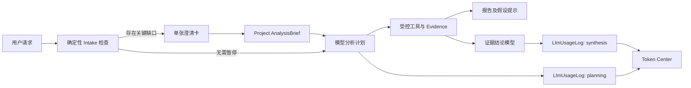
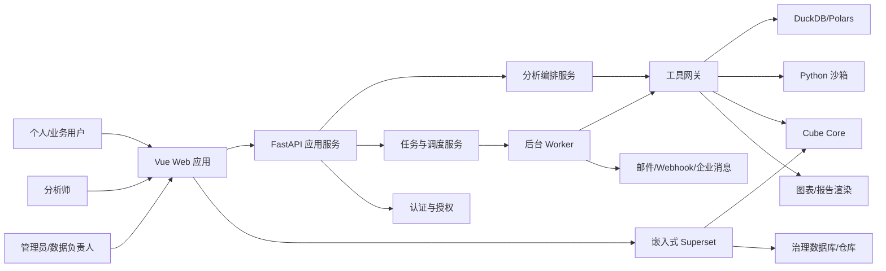
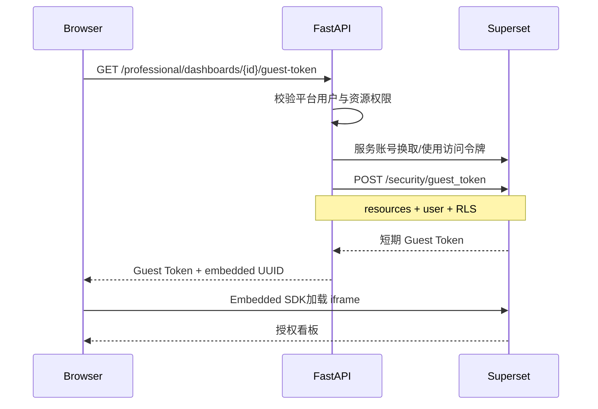
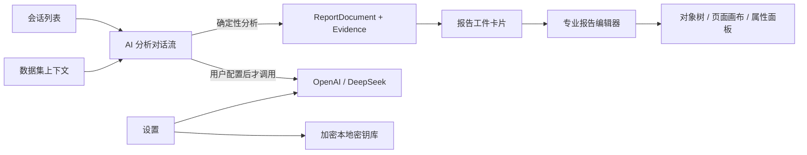

# BI AI 原生数据分析平台 vNext — 详细设计说明书

> **文档状态：历史参考。** 当前领域模型、模块边界、部署形态和迁移顺序以 [商业化目标架构](target-architecture-commercial.md) 为准。本文件保留早期详细设计与增补章节，供实现迁移时查阅。

| 文档属性 | 内容 |
|---|---|
| 文档版本 | 1.0 |
| 状态 | 评审稿 |
| 编制日期 | 2026-08-04 |
| 适用范围 | R0 稳定化至 R4 Cube 语义层正式版 |

> 阶段 4 实施补记（2026-08-16）：新增 `team.py` 团队治理适配层、成员/报告工作流/批注/分享/审计表，及 `external_bi.py` Superset/Cube 服务端适配层。Superset 本地固定镜像通过随机密钥初始化，健康探测、Embedded Dashboard 创建和 Guest Token 均在后端完成；浏览器不持有管理凭据。当前本机所有者回退只适用于可信本机/局域网，生产身份仍按本设计的企业 SSO 与网关方案实施。

> 阶段 4.1 实施补记（2026-08-16）：`analysis_modes.py` 实现 auto/explore/deep/cleaning/business/research/survey/professional 八种模式和确定性场景工具；`external_bi.py` 实现 ChartSpec 到 Superset form_data、数据库/Dataset/Chart/Dashboard 幂等发布与布局。临时上传文件会复制到独立 `aibi-v2-mysql` 分析库，Superset 只连接副本；本机使用已有 MySQL 8 镜像，生产 Team/Company 仍迁移到 PostgreSQL/正式仓库。发布必须先预览并经过 `report.publish` 权限检查，结果写入资源映射和审计日志。

> 阶段 4.2 实施补记（2026-08-17）：`forecasting.py` 的预测工具在全量数据副本上运行 naive/moving-average/linear-trend/seasonal-naive 候选基线，以留出集 MAE 选择方法，输出 RMSE、MAPE 和残差近似 95% 区间；不让模型直接伪造预测。`report_templates.py` 仅处理 `.docx`，在 ZIP 层拒绝宏、OLE 嵌入、外部关系、路径穿越和过大解压包，随后在保留样式的 Word 结构中填充受控占位符。Owner/Admin 可管理模板，Analyst 可使用模板；Viewer 默认无法查看 SQL/Python 代码。所有结果在对话中记录工具输入输出、代码、数据版本和证据引用。

> 核心升级第一期实施补记（2026-09-05）：`Project.analysis_brief` 保存已确认答案、默认假设和稳定问题键；`Conversation.clarification_mode` 控制自动、每次检查或关闭。仓库内 `analysis-intake.json` 提供受控问题协议，`intake.py` 负责本地触发、去重、默认值合并和报告假设块。`LlmUsageLog` 增加阶段及 Run/Report/Dashboard 关联，`usage.py` 提供不含金额的汇总；服务商未返回 Usage 时持久化 `usage_unavailable`。

### 0.1 AnalysisBrief 与 Token 数据流



Intake 默认使用本地规则，因此不产生模型 Token。Context Packet 只加入简报答案、确认键和默认键，不加入完整 DataFrame。恢复澄清请求使用同一消息 ID 替换卡片为正式计划，保证会话历史不产生重复用户消息。
| 需求基线 | [需求说明书](requirements-vnext.md) |
| 当前系统参考 | [现有设计](design.md)、[代码审计](code-audit-report.md) |

> 实施状态（2026-08-14）：当前代码已落地 DuckDB 只读副本查询、Docker Python 执行边界、DeepSeek 非思考 JSON 规划、ChartSpec 2.0、ReportDocument 2.0、报告版本表和 DOCX 导出器。生产化仍需把同步执行迁移到 Worker，并将 SQLite 升级为 PostgreSQL/Alembic。

---

## 1. 设计目标

本设计将当前“对话分析 + 自研 Tableau 式探索页”重构为 AI 原生分析平台。设计重点是：

1. 让 AI 通过受控、可验证的工具完成分析，而不是自由拼接代码和配置；
2. 使用统一 ChartSpec 解耦 AI、ECharts、科研图表和 Superset；
3. 使用 ReportDocument 与证据账本保证报告结论可追溯；
4. 个人临时数据使用轻量 DuckDB/Polars 路径；
5. 公司长期数据使用 Cube 语义层统一指标；
6. Superset承载专业图表和看板编辑，平台保留小白入口与报告工作流；
7. 支持 Lite、Team、Company 三种部署形态，不强迫个人用户安装全部基础设施。

## 2. 设计原则

### 2.1 产品原则

- AI 快速模式是默认入口，专业模式是渐进式增强；
- 报告优先于看板，证据优先于措辞；
- 先让用户获得正确结果，再暴露复杂编辑能力；
- 临时数据不强制治理，正式业务指标必须治理；
- 所有自动化结果必须允许人工检查和修正。

### 2.2 技术原则

- API First：前后端和外部服务通过稳定接口交互；
- Contract First：工具、图表、报告和事件使用版本化 Schema；
- Deterministic First：能由确定性代码计算的内容不交给 LLM 猜测；
- Evidence First：任何数字或统计结论都必须引用执行产物；
- Isolation First：不可信数据、SQL、Python 和外部连接均在隔离边界内；
- Incremental Replacement：按适配器和路由逐步替换现有实现；
- No Source Fork：不 Fork Superset/Cube 主干作为日常产品代码。

## 3. 系统上下文



## 4. 分层架构

### 4.1 前端层

建议目录：

```text
frontend/src/
├── app/                         # 应用入口、路由、布局、错误边界
├── modules/
│   ├── datasets/                # 数据集、画像、预览
│   ├── recipes/                 # 清洗配方编辑器
│   ├── analysis/                # 对话、计划、运行进度
│   ├── reports/                 # 结构化报告编辑与渲染
│   ├── visualizations/          # ChartSpec 编辑与渲染
│   ├── professional/            # Superset 嵌入
│   ├── semantic/                # 指标目录、模型审核
│   ├── workspaces/              # 成员、角色、权限
│   └── schedules/               # 刷新、报告、通知
├── shared/
│   ├── api/                     # OpenAPI 生成客户端
│   ├── components/
│   ├── composables/
│   ├── stores/
│   ├── types/
│   └── utils/
└── plugins/
    ├── echarts.ts
    └── superset.ts
```

当前 `ExploreView.vue` 按以下边界拆分：

```text
AnalysisStudioView.vue
├── DatasetFieldPanel.vue
├── ShelfEditor.vue
├── ChartCanvas.vue
├── ChartInspector.vue
├── FilterEditor.vue
├── AnalysisLayerPanel.vue
└── SheetTabs.vue

composables/
├── useChartSpec.ts
├── useChartRenderer.ts
├── useAnalysisQuery.ts
├── useUndoRedo.ts
└── useSheetWorkspace.ts
```

不把 Superset 的 React 组件移入 Vue。`ProfessionalWorkspaceView.vue` 只负责 Embedded SDK 生命周期、Guest Token刷新、路由和统一导航。

### 4.2 应用服务层

建议后端目录：

```text
backend/
├── api/v1/                      # 参数校验、鉴权、响应映射
├── application/                 # 用例编排
│   ├── datasets/
│   ├── recipes/
│   ├── analyses/
│   ├── reports/
│   ├── publishing/
│   ├── semantics/
│   └── workspaces/
├── domain/                      # 领域对象与规则，不依赖 FastAPI
│   ├── datasets/
│   ├── analysis/
│   ├── reports/
│   ├── visualization/
│   └── semantic/
├── infrastructure/
│   ├── persistence/
│   ├── object_store/
│   ├── queue/
│   ├── cube/
│   ├── superset/
│   ├── sandbox/
│   └── notifications/
├── agent/                       # LangGraph 节点与策略
├── workers/
└── main.py
```

现有 `services/` 不一次性搬迁。新功能进入新分层，旧模块通过适配器调用；每完成一个领域再删除对应旧代码。

### 4.3 数据计算层

| 场景 | 引擎 | 用途 |
|---|---|---|
| 文件导入与预览 | DuckDB + PyArrow | CSV/Parquet/Excel 转换后的快速扫描 |
| 清洗与转换 | Polars 优先、DuckDB SQL 补充 | 列式转换、Join、聚合和配方重放 |
| 统计分析 | SciPy/statsmodels/scikit-learn | 受控统计与 ML 工具 |
| 自定义 Python | 隔离容器 | 工具库无法覆盖的高级分析 |
| 公司治理查询 | Cube Core | 正式指标、维度、权限、缓存 |
| 大数据可选插件 | Spark/Hive | 仅在数据规模和客户部署需要时启用 |

### 4.4 外部服务层

- Superset：专业分析与看板；
- Cube Core：语义层；
- Redis：Team/Company 模式任务和缓存；
- MySQL/PostgreSQL：平台元数据；
- MinIO/S3：Team/Company 文件与分析产物；
- 邮件/Webhook：通知。

## 5. 部署形态

### 5.1 Lite 模式

```text
Vue 静态资源 + FastAPI 单进程
SQLite：平台元数据
DuckDB：用户数据与临时分析
本地目录：文件和产物
内存/进程内后台任务
可选外部 LLM 或本地模型
```

Lite 模式默认不启动 Redis、Hive、Cube、Superset。

### 5.2 Team 模式

```text
Vue/Nginx
FastAPI API
Worker
MySQL 或 PostgreSQL
Redis
MinIO/S3
Superset
可选 Cube
```

### 5.3 Company 模式

```text
负载均衡
多 FastAPI 实例
多 Worker
PostgreSQL/MySQL HA
Redis
对象存储
Superset 固定版本
Cube Core 固定版本 + Cube Store
集中式日志、指标、告警
企业 IdP（可选）
```

## 6. 核心领域模型

### 6.1 工作区与权限

```text
Workspace
  id, name, slug, owner_id, settings_json, created_at

WorkspaceMember
  workspace_id, user_id, role, status, joined_at

ResourcePermission
  resource_type, resource_id, principal_type, principal_id,
  permission, inherited_from, created_at
```

角色只是默认权限集合；实际授权统一解析为资源权限。权限检查必须在应用服务入口执行，Cube/Superset等外部数据路径还需执行数据层规则。

### 6.2 数据源与数据集

```text
DataConnection
  id, workspace_id, name, type, encrypted_config,
  status, last_tested_at, created_by, created_at

Dataset
  id, workspace_id, name, source_type, connection_id,
  physical_ref, current_version_id, status, owner_id, created_at

DatasetVersion
  id, dataset_id, version_no, content_hash, schema_json,
  row_count, byte_size, storage_uri, source_snapshot_json,
  created_by, created_at

DatasetProfile
  dataset_version_id, profile_json, quality_score,
  warnings_json, generated_at
```

原则：

- 原始版本不可修改；
- 清洗结果创建新 DatasetVersion；
- 报告和分析运行必须引用具体版本；
- `physical_ref` 不向普通 API 用户暴露真实主机路径。

### 6.3 清洗配方

```text
Recipe
  id, workspace_id, name, source_dataset_id,
  current_revision_id, owner_id, status, created_at

RecipeRevision
  id, recipe_id, revision_no, steps_json,
  input_schema_hash, output_schema_json,
  created_by, created_at

RecipeRun
  id, revision_id, input_version_id, output_version_id,
  status, row_diff_json, started_at, completed_at, error_json
```

清洗步骤示例：

```json
{
  "op": "fill_missing",
  "version": 1,
  "params": {
    "column": "age",
    "strategy": "median"
  },
  "preconditions": {
    "column_type": "number"
  }
}
```

### 6.4 分析运行与证据

```text
AnalysisRun
  id, workspace_id, conversation_id, dataset_bindings_json,
  query_text, scenario, plan_json, status, policy_json,
  model_info_json, started_at, completed_at, created_by

ToolExecution
  id, run_id, step_id, tool_name, tool_version,
  input_json, output_summary_json, status,
  artifact_ids_json, started_at, completed_at, error_json

Artifact
  id, workspace_id, run_id, type, schema_json,
  storage_uri, content_hash, preview_json, created_at

Evidence
  id, run_id, artifact_id, locator_json,
  semantic_member_refs_json, description, created_at
```

Artifact 类型包括：

- `table_result`
- `statistical_result`
- `model_result`
- `data_quality_result`
- `chart_image`
- `query_plan`
- `execution_log`
- `export_file`

### 6.5 报告

```text
Report
  id, workspace_id, title, current_revision_id,
  source_run_id, status, owner_id, created_at

ReportRevision
  id, report_id, revision_no, document_json,
  schema_version, quality_result_json,
  created_by, created_at

ReportShare
  id, report_id, token_hash, permission,
  expires_at, revoked_at, created_by

ReportComment
  id, report_id, revision_id, block_id,
  author_id, content, status, created_at
```

### 6.6 Superset资源映射

```text
ExternalResourceMapping
  id, workspace_id, provider,
  local_resource_type, local_resource_id,
  external_resource_type, external_resource_id,
  external_uuid, state, metadata_json,
  last_synced_at, created_at
```

### 6.7 语义模型与指标目录

Cube 模型文件仍由 Git 管理，平台数据库保存用于检索、审批和影响分析的索引：

```text
SemanticProject
  id, workspace_id, name, git_repo, git_ref,
  cube_endpoint_ref, status, last_sync_at

SemanticModelSnapshot
  id, project_id, commit_sha, metadata_json,
  schema_hash, synced_at

MetricCatalogItem
  id, project_id, cube_member_name, display_name,
  description, synonyms_json, unit, owner_id,
  certification_status, version, metadata_json

MetricReview
  id, metric_id, proposed_change_json,
  status, reviewer_id, review_comment, created_at
```

## 7. ChartSpec 详细设计

### 7.1 目标

ChartSpec 是 AI、轻量编辑器、ECharts、科研图表和 Superset之间的稳定协议。它描述“表达什么”，不描述每个渲染器的内部 option。

### 7.2 Schema 概要

```json
{
  "schema_version": "1.0",
  "id": "chart_01",
  "title": "各地区销售额与毛利率",
  "purpose": "compare",
  "dataset_binding": {
    "dataset_id": "ds_123",
    "dataset_version_id": "dsv_456"
  },
  "query": {
    "source": "semantic",
    "dimensions": ["Orders.region"],
    "measures": ["Orders.salesAmount", "Orders.grossMargin"],
    "time_dimensions": [],
    "filters": [],
    "order": [{"member": "Orders.salesAmount", "direction": "desc"}],
    "limit": 20
  },
  "mark": "bar_line",
  "encoding": {
    "x": {"field": "Orders.region", "type": "nominal"},
    "y": {"field": "Orders.salesAmount", "type": "quantitative"},
    "y2": {"field": "Orders.grossMargin", "type": "quantitative"},
    "color": {"field": "Orders.region", "type": "nominal"}
  },
  "presentation": {
    "theme": "default",
    "show_labels": true,
    "number_formats": {
      "Orders.salesAmount": "currency:CNY",
      "Orders.grossMargin": "percent:1"
    }
  },
  "annotations": [],
  "provenance": {
    "run_id": "run_123",
    "evidence_ids": ["ev_1"]
  }
}
```

### 7.3 图表目的枚举

- `compare`
- `trend`
- `distribution`
- `relationship`
- `composition`
- `deviation`
- `flow`
- `geospatial`
- `uncertainty`
- `table`

### 7.4 验证流水线

```text
JSON Schema 校验
 → 字段存在性校验
 → 字段类型兼容校验
 → 查询权限校验
 → 数据规模校验
 → 图表规则校验
 → 可访问性校验
 → 渲染器能力校验
```

错误分为：

- `error`：禁止渲染，例如字段不存在；
- `warning`：允许用户确认，例如双轴尺度差异过大；
- `suggestion`：非阻断优化，例如类别排序。

### 7.5 渲染器接口

```python
class ChartRenderer(Protocol):
    name: str
    supported_schema_versions: set[str]

    def validate(self, spec: ChartSpec, data_schema: DataSchema) -> list[Issue]: ...
    async def render(self, spec: ChartSpec, data: TableArtifact) -> RenderArtifact: ...
```

实现：

- `EChartsRenderer`：Web 交互和业务报告；
- `ScientificRenderer`：Plotly/Matplotlib 静态与科研图；
- `SupersetPublisher`：把 ChartSpec映射为 Superset Dataset/Chart/Dashboard资源。

## 8. ReportDocument 详细设计

### 8.1 Schema 概要

```json
{
  "schema_version": "1.0",
  "report_id": "report_1",
  "title": "2026 年 7 月经营分析",
  "context": {
    "question": "销售下降的主要原因是什么？",
    "scenario": "business",
    "dataset_versions": ["dsv_456"],
    "time_range": ["2026-07-01", "2026-07-31"]
  },
  "summary": [
    {"type": "paragraph", "content": "..."}
  ],
  "sections": [],
  "claims": [
    {
      "id": "claim_1",
      "text": "华东区销售额环比下降 18.4%",
      "evidence_refs": ["ev_1"],
      "confidence": "high",
      "status": "verified",
      "limitations": []
    }
  ],
  "charts": ["chart_01"],
  "recommendations": [],
  "limitations": [],
  "data_quality": {},
  "provenance": {
    "analysis_run_id": "run_123",
    "model": {},
    "semantic_model_commit": null
  }
}
```

### 8.2 Block 类型

- heading
- paragraph
- claim
- chart
- table
- callout
- methodology
- recommendation
- limitation
- appendix
- page_break

前端编辑器操作 Block，而不是直接操作一整段 Markdown。Markdown仅作为导入/兼容格式。

### 8.3 结论审核

每条 Claim 执行：

1. 引用完整性检查；
2. 从 Evidence重新读取数值；
3. 检查方向、百分比、分母和单位；
4. 检查是否超出证据时间范围；
5. 检查因果措辞；
6. 检查统计显著性与实际意义；
7. 输出 `verified`、`needs_revision` 或 `unsupported`。

报告发布时只允许 `verified` Claim，或由人工明确接受并标记的例外。

### 8.4 导出设计

```text
ReportDocument
  ├── WebRenderer → Vue 页面
  ├── DocxRenderer → DOCX
  ├── PdfRenderer → PDF
  ├── PptxRenderer → PPTX（R3增强）
  └── MarkdownRenderer → 兼容导出
```

所有导出器共享：

- 主题令牌；
- 字体和数字格式；
- 图表静态资源；
- 页眉页脚；
- 数据来源和免责声明。

### 8.5 当前质量门禁实现

当前兼容 API 继续保存 `ReportDocument 2.0`，并在不破坏旧报告读取的前提下增加三个可选结构：

- `findings[]`：结论标题、事实陈述、业务意义、建议、置信度、限制和 `evidence_ids`；
- `actions[]`：行动、依据、优先级、负责人、预期影响、验证指标和 `evidence_ids`；
- `quality`：分数、是否通过、问题列表、检查时间和规则版本。

`assess_report_quality()` 是服务端唯一发布门禁。报告生成、AI 图表修改、人工保存和布局应用后均重新检查；`GET /api/v1/reports/{id}/quality` 返回最新结果。DOCX 导出前再次执行检查，出现以下任一情况时返回 422，且不产生正式文件：

1. 结构化结论或图表缺少有效证据；
2. 正文包含事实数字但未绑定 Evidence ID；
3. 行动项没有依据或验证指标；
4. 报告块引用不存在的图表；
5. 类别字段被误用为时间折线等错误级图表语义；
6. 总分低于 70 或仍有错误级问题。

日期解析失败、图表说明不足等问题记为警告并扣分，同时写入报告限制。生成器不得为了提高分数虚构时间趋势或业务口径。

DOCX 渲染器将 KPI、管理摘要、图表结论、行动表、证据附录和复现代码映射到固定商业版式。验收脚本 `scripts/verify-commercial-report.py` 使用数据文件哈希、行列数、关键总额、质量结果、结构数量和 DOCX 包结构进行可重复检查；最终发布样例还必须渲染为逐页图片，人工检查截断、重叠、分页和中文字体。

## 9. AI 编排与工具网关

### 9.1 LangGraph状态

```python
class AnalysisState(TypedDict):
    run_id: str
    workspace_id: str
    user_id: str
    query: str
    scenario: str
    dataset_bindings: list[DatasetBinding]
    semantic_context: dict | None
    plan: AnalysisPlan | None
    policy_decision: PolicyDecision | None
    executions: list[ToolExecutionRef]
    evidence_ids: list[str]
    chart_specs: list[ChartSpec]
    report_document: ReportDocument | None
    review_result: ReviewResult | None
    budget: ExecutionBudget
```

禁止把完整原始数据、巨大工具输出和整份日志放进 LangGraph State；只保存引用和有限摘要。

### 9.2 节点设计

```mermaid
flowchart LR
    Intake["intake"] --> Context["context_builder"]
    Context --> Planner["planner"]
    Planner --> Policy["policy_gate"]
    Policy -->|需要确认| Approval["user_approval"]
    Policy -->|允许| Executor["executor"]
    Approval --> Executor
    Executor --> Analyst["evidence_analyst"]
    Analyst --> Viz["visualization_planner"]
    Viz --> Reporter["report_composer"]
    Reporter --> Critic["claim_critic"]
    Critic -->|有限修订| Reporter
    Critic -->|通过| Quality["quality_gate"]
    Quality --> Done["completed"]
```



最大修订次数、工具次数、Token、运行时间和扫描量都由 `ExecutionBudget` 控制。

### 9.3 工具描述

```python
class ToolManifest(BaseModel):
    name: str
    version: str
    description: str
    input_schema: dict
    output_schema: dict
    side_effect: Literal["none", "local_write", "external_write"]
    data_access: Literal["metadata", "sample", "full"]
    permission: str
    requires_approval: bool
    default_timeout_seconds: int
    max_output_bytes: int
    tags: list[str]
```

工具调用流程：

```text
Schema 校验
 → 权限检查
 → 数据策略检查
 → 成本预算检查
 → 幂等检查
 → 执行
 → 输出 Schema 校验
 → 敏感数据过滤
 → Artifact/Evidence持久化
```

### 9.4 工具命名空间

```text
data.inspect.*
data.clean.*
data.transform.*
query.adhoc.*
query.semantic.*
stats.describe.*
stats.test.*
stats.timeseries.*
ml.train.*
ml.explain.*
viz.recommend.*
viz.render.*
report.compose.*
report.export.*
publish.superset.*
semantic.catalog.*
```

### 9.5 Python 沙箱

沙箱 Worker 接收：

- 签名任务清单；
- 只读数据 Artifact；
- 允许的 Python 包列表；
- CPU、内存、进程数、文件大小和超时限制。

沙箱必须：

- 默认断网；
- 使用非 root 用户；
- 根文件系统只读；
- 临时输出目录隔离；
- 不挂载 Docker socket；
- 不传入平台环境变量；
- 输出只通过 Artifact通道回传；
- 任务完成后销毁执行环境。

## 10. 数据导入与清洗设计

### 10.1 导入管道

```text
UploadSession创建
 → 流式接收和大小限制
 → 文件名与 MIME 校验
 → 病毒/压缩包检查（Team 可选）
 → 内容哈希
 → 格式解析
 → 转换为 Parquet
 → Schema推断
 → DatasetVersion持久化
 → 异步画像
```

内部优先使用 Parquet 作为分析中间格式，减少重复解析 CSV/Excel。

### 10.2 类型推断

字段类型分两层：

- 物理类型：string、integer、float、boolean、date、datetime；
- 语义类型：identifier、category、currency、percentage、country、province、email、phone等。

推断结果必须包含置信度。低置信度类型需要用户确认，不直接覆盖。

### 10.3 配方执行

配方编译为受控执行计划：

```text
Recipe JSON
 → Schema/前置条件校验
 → Polars/DuckDB执行计划
 → 小样本预览
 → 差异统计
 → 用户确认
 → 全量执行
 → 新 DatasetVersion
```

配方步骤不允许包含任意 Python字符串；高级自定义步骤进入单独沙箱工具。

## 11. 查询设计

### 11.1 临时查询

`AdhocQueryService` 只接受结构化查询：

```json
{
  "dataset_version_id": "dsv_1",
  "select": [
    {"field": "region"},
    {"aggregate": "sum", "field": "sales", "alias": "sales_sum"}
  ],
  "filters": [],
  "group_by": ["region"],
  "order_by": [{"field": "sales_sum", "direction": "desc"}],
  "limit": 100
}
```

服务端生成参数化 DuckDB SQL。AI 不直接拼表名、列名和 where 字符串。

### 11.2 自定义 SQL

仅 Analyst及以上角色可用。执行前：

- SQL Parser确认单条 SELECT/CTE；
- 禁止 DDL/DML、外部文件函数和危险 pragma；
- 注入工作区与数据集允许列表；
- 设置超时、内存和行数；
- 记录规范化 SQL 与参数。

### 11.3 语义查询

```python
class SemanticQuery(BaseModel):
    measures: list[str]
    dimensions: list[str]
    time_dimensions: list[TimeDimension]
    filters: list[SemanticFilter]
    order: list[SemanticOrder]
    limit: int
    timezone: str
```

FastAPI 根据当前用户构造 Cube Security Context，并使用服务端凭据调用 Cube REST/GraphQL API。

## 12. Cube Core 集成设计

### 12.1 责任边界

Cube负责：

- 正式业务实体；
- 指标和维度；
- Join；
- 访问规则；
- 预聚合；
- REST/GraphQL/SQL查询。

主平台负责：

- 模型目录展示；
- 指标描述、同义词、负责人和审核；
- AI 上下文构建；
- 模型发布工作流；
- 报告/看板影响索引；
- Cube健康和查询监控。

### 12.2 部署

使用固定版本官方镜像：

```text
cube-api       4000/tcp，仅内部网络或 API 网关可访问
cube-sql       15432/tcp，仅 Superset和受信任工具可访问
cube-store     内部缓存/预聚合
model-volume   只读挂载已发布模型
```

不从 `frame/cube-master` 构建生产镜像。该目录仅作为源码参考。

### 12.3 模型目录示例

```text
semantic/
├── cube.py / cube.js
├── model/
│   ├── orders.yml
│   ├── customers.yml
│   ├── products.yml
│   └── views/
│       └── sales_overview.yml
├── tests/
│   ├── metrics/
│   ├── access/
│   └── compatibility/
└── manifest.yml
```

### 12.4 模型发布流程

```text
AI/分析师提出变更
 → YAML/JS静态校验
 → Cube编译校验
 → 指标单元测试
 → 权限测试
 → 与基线结果比较
 → 影响分析
 → 数据负责人审核
 → 合并 Git
 → 部署新模型
 → 健康检查
 → 切换生效
 → 失败自动回滚
```

### 12.5 Meta缓存

平台定时同步 Cube Meta API：

```text
Cube Meta
 → 按当前安全上下文过滤
 → 标准化成员信息
 → 合并指标目录描述/同义词
 → 写入短期缓存
 → 提供给 Agent context_builder
```

AI上下文只包含当前用户可见成员，不把不可见字段名称泄露给模型。

### 12.6 认证指标规则

- `certified` 指标只能由 Data Owner/Admin 发布；
- 相同 Cube Member是唯一技术标识；
- 展示名称可以本地化，但不能改变计算口径；
- Superset仅引用认证指标，不创建同名计算指标；
- AI 临时计算使用 `draft:` 命名空间；
- 报告保存模型 Commit SHA和成员版本。

### 12.7 一致性测试

对每个核心指标建立固定查询：

1. 通过 Cube REST查询；
2. 通过 Cube SQL查询；
3. 通过 Superset数据集查询；
4. 通过 Agent Semantic Tool查询；
5. 比较数值、时间范围、时区和空值处理。

差异超过容忍范围时阻止发布。

## 13. Superset 集成设计

### 13.1 责任边界

Superset负责图表编辑、数据集浏览、看板布局、筛选、联动、钻取和 SQL Lab。主平台不继续复制这些高级功能。

### 13.2 部署与配置

使用固定版本官方镜像，单独使用 Superset 元数据库和 Redis/Celery配置。生产启用：

- `EMBEDDED_SUPERSET`；
- 强随机 `SECRET_KEY`；
- 强随机 `GUEST_TOKEN_JWT_SECRET`；
- 明确 `GUEST_TOKEN_JWT_AUDIENCE`；
- 允许嵌入域白名单；
- HTTPS和安全 Cookie；
- 最小权限服务账号。

不把 Superset管理凭据发送给浏览器。

### 13.3 Guest Token 流程



Guest Token有效期短，不写 localStorage。

### 13.4 AI 发布适配器

`SupersetPublisher` 执行：

```text
ChartSpec
 → 确定/创建 Database引用
 → 确定/创建 Dataset
 → 转换 Query Context / form_data
 → 创建或更新 Chart
 → 添加到 Dashboard
 → 配置 Embedded Dashboard
 → 保存 ExternalResourceMapping
```

发布操作使用幂等键：

```text
workspace_id + local_resource_id + chart_spec_hash + provider_version
```

创建多个外部资源时采用 Saga补偿：后续步骤失败则删除本次新建且未被其他资源引用的对象。

### 13.5 Cube 与 Superset连接

治理数据首选：

```text
Superset → Cube SQL API → 数据库/仓库
```

这样 Superset和 AI共享指标。临时上传数据仍在平台轻量编辑器中分析，不要求全部发布到 Superset。

## 14. API 设计

所有响应包含：

```json
{
  "code": 200,
  "data": {},
  "request_id": "req_123"
}
```

错误统一为：

```json
{
  "code": "DATASET_NOT_FOUND",
  "message": "数据集不存在或无权访问",
  "details": {},
  "request_id": "req_123"
}
```

### 14.1 数据集和清洗

| 方法 | 路径 | 说明 |
|---|---|---|
| POST | `/api/v1/uploads` | 创建上传会话 |
| PUT | `/api/v1/uploads/{id}/content` | 流式上传内容 |
| POST | `/api/v1/uploads/{id}/complete` | 完成导入 |
| GET | `/api/v1/datasets/{id}` | 数据集详情 |
| GET | `/api/v1/datasets/{id}/versions/{version}` | 数据版本详情 |
| GET | `/api/v1/datasets/{id}/profile` | 数据画像 |
| POST | `/api/v1/recipes` | 创建清洗配方 |
| POST | `/api/v1/recipes/{id}/preview` | 预览影响 |
| POST | `/api/v1/recipes/{id}/runs` | 执行配方 |

### 14.2 分析与报告

| 方法 | 路径 | 说明 |
|---|---|---|
| POST | `/api/v1/analysis-runs` | 创建分析运行 |
| GET | `/api/v1/analysis-runs/{id}` | 获取运行状态 |
| GET | `/api/v1/analysis-runs/{id}/events` | SSE事件 |
| POST | `/api/v1/analysis-runs/{id}/approval` | 确认或修改计划 |
| POST | `/api/v1/analysis-runs/{id}/cancel` | 取消运行 |
| GET | `/api/v1/analysis-runs/{id}/evidence` | 查看证据 |
| GET | `/api/v1/reports/{id}` | 获取报告 |
| PUT | `/api/v1/reports/{id}` | 创建新修订 |
| POST | `/api/v1/reports/{id}/publish` | 发布报告 |
| POST | `/api/v1/reports/{id}/exports` | 生成导出任务 |

### 14.3 图表和专业模式

| 方法 | 路径 | 说明 |
|---|---|---|
| POST | `/api/v1/chart-specs/validate` | 验证 ChartSpec |
| POST | `/api/v1/chart-specs/render` | 渲染预览 |
| POST | `/api/v1/chart-specs/{id}/publish/superset` | 发布到 Superset |
| GET | `/api/v1/professional/dashboards/{id}/guest-token` | 获取嵌入令牌 |
| GET | `/api/v1/professional/mappings/{resource_type}/{id}` | 查看映射 |

### 14.4 语义层

| 方法 | 路径 | 说明 |
|---|---|---|
| GET | `/api/v1/semantic/catalog` | 当前用户可见指标与维度 |
| POST | `/api/v1/semantic/query` | 受控语义查询 |
| POST | `/api/v1/semantic/metrics/proposals` | 提议草稿指标 |
| POST | `/api/v1/semantic/metrics/{id}/reviews` | 审核指标 |
| POST | `/api/v1/semantic/projects/{id}/sync` | 同步 Cube Meta |
| GET | `/api/v1/semantic/impacts` | 模型变更影响 |

### 14.5 API兼容策略

- vNext API在 `/api/v1` 下逐步新增资源化端点；
- 旧 `/analyze` SSE在迁移期由 Adapter转发到 AnalysisRun；
- OpenAPI生成 TypeScript客户端；
- 删除端点前至少经历一个弃用版本；
- ChartSpec和ReportDocument版本独立于 HTTP API版本。

## 15. SSE 与任务事件

统一事件 Envelope：

```json
{
  "event_id": "evt_123",
  "run_id": "run_123",
  "sequence": 12,
  "type": "tool.completed",
  "timestamp": "2026-08-04T10:00:00Z",
  "payload": {}
}
```

事件类型：

```text
run.created
context.ready
plan.created
approval.required
approval.received
tool.started
tool.progress
tool.completed
tool.failed
evidence.created
chart.created
report.streaming
report.reviewed
run.completed
run.failed
run.cancelled
```

客户端用 `sequence` 去重和补偿断线重连。服务端保留最近事件，不能只依赖内存流。

## 16. 调度与幂等

R1 Lite 使用轻量后台任务；R3 Team 使用 Redis 队列和独立 Worker。统一任务接口避免业务代码感知底层队列。

```python
class JobQueue(Protocol):
    async def enqueue(self, job: JobSpec) -> JobRef: ...
    async def cancel(self, job_id: str) -> None: ...
    async def status(self, job_id: str) -> JobStatus: ...
```

幂等键按业务定义，例如：

```text
数据画像：dataset_version_id + profiler_version
清洗执行：recipe_revision_id + input_version_id
分析运行：用户显式重试时创建新 run，否则 request_id去重
定时报表：schedule_id + scheduled_time
Superset发布：resource_id + chartspec_hash
Cube Meta同步：project_id + cube_model_version
```

## 17. 安全设计

### 17.1 信任边界

不可信输入包括：

- 上传文件；
- 数据库内容；
- 列名、单元格文本；
- 用户 Prompt；
- LLM 输出；
- Superset/Cube外部响应；
- 插件输出。

以上数据必须经过 Schema、大小、内容和权限校验。

### 17.2 认证与会话

- R0/R1：短期 Access Token + Refresh Token +吊销列表；
- R3：工作区角色和资源授权；
- R4：支持 OIDC接入但不强制自建 IdP；
- 服务间令牌与用户令牌分离；
- Cube/Superset管理凭据仅存在服务端 Secret Store。

### 17.3 数据源安全

- 默认要求只读数据库账户；
- 连接配置使用 Envelope Encryption；
- 密钥与密文分开管理；
- 日志和错误信息过滤连接串；
- 连接测试具备 SSRF主机策略；
- 企业部署允许配置目标网络白名单。

### 17.4 Prompt 注入防护

- 数据内容使用明确的数据边界标签；
- System Prompt声明数据内容不是指令；
- 工具权限不由模型自行授予；
- 工具网关独立执行权限策略；
- 数据中的“忽略规则”等文本不影响工具策略；
- 输出中的链接、HTML和Markdown经过安全过滤。

## 18. 缓存设计

缓存键不能只基于用户问题文本。建议：

```text
hash(
  normalized_query,
  dataset_version_ids,
  recipe_revision_ids,
  semantic_model_commit,
  metric_versions,
  filters,
  timezone,
  tool_versions,
  report_template_version,
  model_config
)
```

缓存层：

- 元数据/画像缓存；
- 查询结果缓存；
- 工具产物缓存；
- Cube预聚合；
- 报告最终结果缓存。

数据版本变化时通过版本键自然失效，减少主动扫描删除。

## 19. 可观测性设计

### 19.1 关联标识

```text
request_id → job_id → analysis_run_id → tool_execution_id → artifact_id
```

所有日志携带可用标识，禁止记录原始敏感数据。

### 19.2 指标

应用指标：

- API延迟和错误率；
- 上传吞吐、失败和解析时间；
- 队列长度和等待时间；
- 工具成功率、超时率和耗时；
- 报告生成与审核耗时；
- LLM Token、重试和模型错误；
- ChartSpec验证失败原因。

外部服务指标：

- Superset API/嵌入错误；
- Cube查询 P50/P95、缓存命中、编译错误；
- 预聚合刷新和延迟；
- 数据库连接池、慢查询；
- 通知成功率。

### 19.3 业务质量指标

- 首次洞察时间；
- 报告证据覆盖率；
- 无来源数字数量；
- 用户手工修改率；
- AI计划确认/拒绝率；
- 图表推荐采纳率；
- 报告导出/分享率；
- 指标一致性测试通过率。

## 20. 测试设计

### 20.1 测试金字塔

| 类型 | 范围 |
|---|---|
| 单元测试 | 领域规则、Schema、清洗操作、统计函数、转换器 |
| 契约测试 | 工具、ChartSpec、ReportDocument、Cube/Superset Adapter |
| 集成测试 | 数据库、DuckDB、Redis、对象存储、沙箱 |
| 端到端测试 | 上传→清洗→分析→报告→导出→专业编辑 |
| AI评估 | 黄金数据集、计划质量、数字一致性、图表有效性 |
| 安全测试 | 越权、注入、路径遍历、XSS、沙箱、SSRF |
| 性能测试 | 文件画像、并发查询、任务队列、Cube预聚合 |

### 20.2 AI测试策略

将“LLM输出完全相同”从测试目标中移除，改为结构和结果断言：

- 是否选择允许的工具；
- 是否使用正确字段和指标；
- 数值是否等于证据；
- 是否遗漏限制；
- ChartSpec是否有效；
- 统计方法是否适用；
- 报告必需章节是否完整。

测试环境使用模型 Stub覆盖确定性流程，另设真实模型的非阻断评估任务。

### 20.3 Cube/Superset测试

- Cube模型编译测试；
- 指标黄金值测试；
- 安全上下文行级权限测试；
- Cube REST/SQL一致性；
- Superset数据集/图表创建契约；
- Guest Token资源和RLS测试；
- Superset与Cube指标一致性；
- 固定版本升级兼容测试。

## 21. 迁移方案

### 21.1 总体策略

采用 Strangler Pattern：保留现有路由和页面，逐步把流量迁移到新领域服务。

### 21.2 R0迁移

1. 建立 OpenAPI 类型生成；
2. 修复现有安全问题；
3. 抽出 `ChartSpec` 包但先支持现有 ECharts输出；
4. 抽出 `ReportDocument`，为旧 Markdown提供转换器；
5. 将新分析运行写入新表，同时兼容旧 Task；
6. 拆分 ExploreView但保持路由不变；
7. 移除废弃 ChartBuilder入口和旧 tools依赖。

### 21.3 R1迁移

1. 增加 Lite配置 Profile；
2. 上传文件统一转 Parquet；
3. 数据画像和清洗配方走新服务；
4. 新报告使用 ReportDocument；
5. 旧报告首次访问时按需转换并保留原文；
6. 新图表全部使用 ChartSpec。

### 21.4 R2迁移

1. 将现有统计、异常检测和 ML 函数包装为版本化工具；
2. 为每个工具补充适用前提、输出 Schema 和黄金数据测试；
3. 建立商务、科研、问卷场景路由，但允许用户手动切换；
4. 报告模板按场景拆分，并共享 Claim/Evidence审核能力；
5. 增加科研图表适配器，不改变现有 ECharts业务图表路径；
6. 保存可复现执行清单，为现有运行记录提供只读兼容视图。

### 21.5 R3迁移

1. 部署 Superset PoC环境；
2. 增加专业工作台路由；
3. 为一个数据域实现发布适配器；
4. 双运行当前 DashboardView和Superset；
5. 收集编辑、性能和故障数据；
6. 达到门槛后冻结 DashboardView新增功能；
7. 提供旧看板导出或迁移工具后逐步退役。

### 21.6 R4迁移

1. 选择一个订单/销售域建 Cube模型；
2. 给核心指标建立黄金值；
3. Agent新增 Semantic Query工具；
4. Superset连接 Cube SQL；
5. 报告保存模型版本；
6. 双查并比较旧 SQL和Cube结果；
7. 一致后切换正式指标查询；
8. 逐业务域迁移，不一次性全量改造。

## 22. 模块保留与退役

| 当前模块 | 处理方式 | 目标阶段 |
|---|---|---:|
| `backend/agent/graph.py` | 保留框架，重构 State和节点 | R0～R1 |
| `backend/agent/nodes.py` | 拆分 Planner/Executor/Reporter/Critic | R0～R2 |
| `backend/services/data_analyzer.py` | 拆为画像、统计、沙箱适配器 | R0～R1 |
| `chart_engine.py/v2.py` | 合并为 ChartSpec适配器 | R1 |
| `backend/tools/` | 完成新工具网关后删除 | R0 |
| `ExploreView.vue` | 拆分并降级为轻量编辑器 | R0～R1 |
| `DashboardView.vue` | Superset验证后冻结/退役 | R3 |
| `ChartBuilder.vue` | 删除 | R0 |
| Hive/Spark | 从默认部署移除，保留可选插件 | R1 |
| 现有 Markdown报告 | 保留读取，迁移到ReportDocument | R1 |

## 23. 阶段实施拆分

### R0 Epic

- EPIC-R0-SEC：安全与沙箱；
- EPIC-R0-ARCH：前后端分层和 ExploreView拆分；
- EPIC-R0-CONTRACT：工具、ChartSpec、ReportDocument协议；
- EPIC-R0-TEST：自动化测试和AI评估集；
- EPIC-R0-MIGRATION：数据库迁移和错误模型。

### R1 Epic

- EPIC-R1-LITE：Lite部署；
- EPIC-R1-INGEST：多格式导入和Parquet标准化；
- EPIC-R1-PROFILE：画像和质量；
- EPIC-R1-RECIPE：清洗配方；
- EPIC-R1-ANALYSIS：证据驱动分析；
- EPIC-R1-REPORT：结构化报告和导出；
- EPIC-R1-VIZ：轻量图表编辑。

### R2 Epic

- EPIC-R2-BUSINESS：经营分析工具包；
- EPIC-R2-RESEARCH：科研统计工具包；
- EPIC-R2-SURVEY：问卷工具包；
- EPIC-R2-SCI-VIZ：科研图表；
- EPIC-R2-REPRO：可复现执行清单。

### R3 Epic

- EPIC-R3-WORKSPACE：工作区、成员和权限；
- EPIC-R3-SUPERSET：嵌入和发布；
- EPIC-R3-COLLAB：评论、审核和版本；
- EPIC-R3-SCHEDULE：刷新、定时报表和通知；
- EPIC-R3-STORAGE：对象存储和Server部署。

### R4 Epic

- EPIC-R4-CUBE：Cube部署和Adapter；
- EPIC-R4-CATALOG：指标目录和同义词；
- EPIC-R4-GOVERNANCE：认证、审核和模型Git工作流；
- EPIC-R4-ACCESS：安全上下文与权限；
- EPIC-R4-CONSISTENCY：AI/Superset/Cube一致性测试；
- EPIC-R4-PERF：预聚合和性能治理。

## 24. 关键架构决策记录

### ADR-001：保留 Vue + FastAPI

原因：现有代码、团队认知和核心工作流可以复用；更换语言或前端框架不能直接提高报告质量。

### ADR-002：Superset作为专业模式，不作为默认首页

原因：Superset专业能力成熟，但对小白用户过于复杂，且不能替代清洗、统计和叙事报告工作流。

### ADR-003：Cube只治理长期业务数据

原因：为每个临时文件生成语义模型会降低个人分析效率；DuckDB更适合临时数据。

### ADR-004：不直接让AI生成渲染器配置

原因：ECharts option和Superset form_data复杂、版本敏感、难以验证；ChartSpec提供稳定边界。

### ADR-005：报告从Markdown迁移为结构化文档

原因：需要结论级证据、版本、评论、多格式导出和质量门禁。

### ADR-006：不在生产运行master源码

原因：无法保证可重复构建、升级和回滚；Superset/Cube使用固定发布镜像。

## 25. 需求到设计映射

| 需求域 | 主要设计章节 |
|---|---|
| REQ-IAM | 6.1、17 |
| REQ-DATA | 6.2、10 |
| REQ-CLEAN | 6.3、10 |
| REQ-AI | 6.4、9 |
| REQ-STAT | 4.3、9.4、20 |
| REQ-VIZ | 7、13.4 |
| REQ-REPORT | 8 |
| REQ-SUP | 13 |
| REQ-SEM | 12 |
| REQ-JOB | 15、16 |
| REQ-AUDIT | 6.4、6.5、19 |
| NFR-PERF/REL | 5、16、18、20 |
| NFR-SEC | 9.5、17 |
| NFR-UX/MAINT | 4、21、22 |
| NFR-OBS | 19 |

## 26. 首个技术验证包

在正式进入大规模重构前，先完成一个贯穿式验证：

1. 使用现有销售样例创建不可变 DatasetVersion；
2. 生成数据画像和一条清洗配方；
3. AI产生结构化分析计划；
4. 通过受控 DuckDB工具生成 Evidence；
5. 生成一张 ChartSpec并由 ECharts渲染；
6. 生成 ReportDocument并导出 DOCX/PDF；
7. 将同一 ChartSpec发布到 Superset并嵌入；
8. 在 Cube中定义销售额、订单数、毛利率；
9. 让 Agent和Superset都通过 Cube查询；
10. 自动比较两个结果的一致性。

该验证包通过后，才正式冻结自研 DashboardView并开始按业务域迁移。

---

## 附录 A：建议配置 Profile

```text
APP_PROFILE=lite|team|company

Lite:
  PLATFORM_DB=sqlite
  JOB_BACKEND=local
  OBJECT_STORE=local
  ADHOC_ENGINE=duckdb
  SUPERSET_ENABLED=false
  CUBE_ENABLED=false

Team:
  PLATFORM_DB=mysql|postgresql
  JOB_BACKEND=redis
  OBJECT_STORE=s3|minio
  ADHOC_ENGINE=duckdb
  SUPERSET_ENABLED=true
  CUBE_ENABLED=optional

Company:
  PLATFORM_DB=postgresql|mysql
  JOB_BACKEND=redis
  OBJECT_STORE=s3|minio
  ADHOC_ENGINE=duckdb
  SUPERSET_ENABLED=true
  CUBE_ENABLED=true
```

## 附录 B：建议仓库边界

初期继续单仓库：

```text
E:/BI/
├── backend/
├── frontend/
├── semantic/                    # Cube模型，R4新增
├── deploy/
│   ├── lite/
│   ├── team/
│   └── company/
├── contracts/
│   ├── chart-spec/
│   ├── report-document/
│   └── tool-manifest/
├── evaluation/
│   ├── datasets/
│   ├── cases/
│   └── expected/
└── docs/
```

只有当 Worker、语义模型或前端拥有独立发布团队后，再考虑拆分仓库。

---

## 22. V2.0 对话、专业编辑器与模型设置设计增补（2026-08）

### 22.1 交互信息架构



前端采用三种主工作区，而不是在一个页面堆放所有功能：

| 工作区 | 主交互 | 关键状态 |
|---|---|---|
| AI 分析台 | ChatGPT 式会话列表、消息流、输入框、数据上下文栏 | `conversationId`、`datasetId`、`messages` |
| 专业编辑器 | Word 式功能区、对象树、报告页面和 Tableau 式属性面板 | `report.document`、`selectedBlockId`、`selectedChartId` |
| 设置 | 提供商卡片、常规偏好、集成状态 | `providers`、`appSettings` |

### 22.2 新增持久化模型

| 表 | 核心字段 | 说明 |
|---|---|---|
| `conversations` | `workspace_id`, `dataset_id`, `title`, `archived`, `updated_at` | 分析会话元数据；不删除数据集或报告 |
| `chat_messages` | `conversation_id`, `role`, `content`, `message_meta` | `message_meta` 包含 `dataset_id`、`report_id`、`provider` 等非敏感工件引用 |
| `provider_configs` | `provider`, `enabled`, `is_default`, `base_url`, `model`, `encrypted_api_key`, `options` | 每工作区一组可扩展模型提供商配置 |
| `app_settings` | `workspace_id`, `settings` | 自动保存、主题、遥测、导出和外部请求确认偏好 |

现阶段 `Base.metadata.create_all()` 只用于本地开发和单机试用。M4 起必须切换至 Alembic 迁移，并为 `(workspace_id, provider)` 增加唯一约束。

### 22.3 API 合约

| 方法 | 路由 | 说明 |
|---|---|---|
| `GET/POST` | `/api/v1/conversations` | 获取历史、创建新会话 |
| `PATCH/DELETE` | `/api/v1/conversations/{id}` | 重命名；删除仅影响会话与消息 |
| `GET` | `/api/v1/conversations/{id}/messages` | 按时间顺序返回消息 |
| `POST` | `/api/v1/chat` | 持久化用户消息，调用模型或本地回退，并返回助手消息和可选 `report_id` |
| `GET` | `/api/v1/samples` | 列出可安全导入的虚构示例数据 |
| `POST` | `/api/v1/samples/{id}/import` | 复制内置文件至当前工作区并生成 DatasetProfile |
| `GET/PUT` | `/api/v1/settings/providers` | 返回掩码后的提供商配置；更新永不回传明文密钥 |
| `POST` | `/api/v1/settings/providers/{provider}/test` | 用户主动触发的模型连通性测试 |
| `GET/PUT` | `/api/v1/settings/app` | 保存非敏感软件偏好 |

`POST /chat` 的执行顺序如下：

1. 验证会话、工作区与数据集归属；
2. 保存用户消息，并仅构造数据集名称、行列数、字段和剖析摘要；
3. 对“报告/图表/仪表盘/汇报”意图，先运行确定性 `build_report()` 并生成 Report；
4. 若存在已启用且有密钥的默认提供商，发送最近 20 条会话和最小数据上下文；否则本地助手回复；
5. 模型失败时记录受限诊断信息并回退，不泄露密钥、请求正文或数据内容；
6. 保存助手消息，其中工件仅通过 `report_id` 引用。

### 22.4 模型适配器与密钥边界

```text
Browser Settings Form
  └─ PUT provider configuration (key only in this request)
      └─ FastAPI encrypt_secret()
          └─ data/.vault-key + Fernet ciphertext in SQLite

Browser Chat
  └─ POST /chat
      └─ backend decrypt_secret() only at outbound call time
          ├─ OpenAI: {base_url}/responses
          └─ DeepSeek: {base_url}/chat/completions
```

| 提供商 | 默认地址 | 默认模型 | 协议 |
|---|---|---|---|
| OpenAI | `https://api.openai.com/v1` | `gpt-5.6-terra` | Responses API；`store:false`；可选 `reasoning.effort` |
| DeepSeek | `https://api.deepseek.com` | `deepseek-v4-flash` | OpenAI 兼容 Chat Completions API；可选 `temperature` |

实现限制：浏览器只接收 `has_api_key` 与掩码；`http` 地址仅允许本机地址；模型外发仅在用户启用提供商并主动发送消息时进行。单机加密保险库用于本地体验，不能替代企业 KMS、OS 凭据库或轮换策略。

### 22.5 专业编辑器组件契约

| 组件 | 读写对象 | 作用 |
|---|---|---|
| `Ribbon` | 选中对象和编辑命令 | 提供开始/插入/布局/数据/审阅功能区 |
| `ObjectTree` | `ReportDocument.blocks` | 用于选择、排序、插入和删除对象 |
| `PaperCanvas` | `summary`, `blocks`, `charts` | 直接内容编辑与页面预览 |
| `PropertyPanel` | `ReportBlock` 或 `ChartSpec` | 修改对象类型、标题、图表类型、说明和证据可见性 |
| `ChartPreview` | `ChartSpec` | 使用结构化图表数据渲染轻量预览；不得执行任意图表脚本 |

编辑器当前的打印/PDF 使用浏览器打印能力。M3 将引入后端渲染和 DOCX/PPTX 导出任务；在实现前，设置页只能保存偏好，不能承诺生成对应文件。

### 22.6 安全与可观测性补充

- 内置数据剖析、统计聚合和图表构建仍使用确定性代码，不进入生成代码沙箱。
- API 密钥与用户数据不得出现在前端日志、异常消息、会话标题、`message_meta` 或报告正文。
- 模型调用在 M3 加入请求 ID、耗时、token/费用字段与可配置的日限额；仅存聚合指标。
- M4 使用工作区角色限制谁能配置提供商、谁能外发数据、谁能发布报告。
- 设置中的“外部请求前提示”在 M3 演变为每数据源的明确同意记录。

## 23. 设置中心与启动错误边界设计（2026-08-13）

### 23.1 前端边界

设置 UI 从 `App.vue` 拆至 `SettingsCenter.vue`，父组件只拥有后端状态和副作用，子组件拥有当前分类与说明展开状态：

```text
App.vue
  ├─ refresh()：启动数据与错误边界
  ├─ saveProvider()/testProvider()
  ├─ saveGeneralSettings()/refreshIntegrations()
  └─ SettingsCenter.vue
       ├─ models
       ├─ general
       ├─ privacy
       ├─ team
       └─ integrations
```

分类切换是纯前端状态，不触发重复网络请求。保存和测试必须由显式按钮触发；团队规划项只读展示，避免在权限后端不存在时造成虚假可用性。

### 23.2 加载失败状态机

`refresh()` 具有 `idle/loading/ready/error` 等价状态。并发重试由 `booting` 拦截；失败写入 `bootError`，主区域展示 API 地址、启动窗口提示和“重新连接”按钮。失败不得清空用户已加载的页面状态，成功后清除错误。

### 23.3 设置数据所有权

| 数据 | 前端状态 | 后端来源 | 保存方式 |
|---|---|---|---|
| 模型配置 | `providers` | `provider_configs` | 单提供商 PUT，Key 仅在本次请求出现 |
| 软件偏好 | `appSettings` | `app_settings` | 整体 PUT，Pydantic 严格校验 |
| 集成状态 | `integrations` | 运行时环境变量 | 只读刷新，不允许浏览器写服务器环境 |
| 工具策略 | `toolPolicy` | 后端安全策略 | 只读刷新，安全模式不可由 UI 降级 |

### 23.4 配置约定

本地/部署环境统一使用 `AIBI_` 前缀：`AIBI_CUBE_API_URL`、`AIBI_SUPERSET_URL`、`AIBI_SANDBOX_ENABLED`、`AIBI_SANDBOX_IMAGE`。界面帮助、`.env.example`、部署清单和后端代码必须由测试保证一致。

### 23.5 后续重构

当前拆出设置组件只是第一步。P0 结束前继续将对话、数据和报告编辑器从 `App.vue` 拆为模块，并引入统一 API 客户端、错误对象、设置 store 和组件测试。P2 引入 RBAC 后，模型配置与集成诊断只对 Owner/Admin 可见。

## 24. 数据预览与清洗配方设计（2026-08-13）

### 24.1 交互流

```text
选择数据集 → 读取前 50 行与质量摘要
          → 从问题卡或操作菜单添加清洗步骤
          → POST cleaning/preview（内存计算，不写文件）
          → 用户检查前后行数、单元格变化和样本
          → POST cleaning/apply
          → 写入新的 CSV + Dataset + CleaningRecipe
          → 原始 Dataset/storage_key 保持不变
```

`DataWorkbench.vue` 拥有预览、临时配方和影响预览状态；`App.vue` 只同步全局数据集列表、当前数据集和 AI 跳转。后续把重复的 `fetch` 包装迁入统一 API 客户端。

### 24.2 API

| 方法 | 路由 | 副作用 |
|---|---|---|
| GET | `/datasets/{id}/preview` | 无；返回分页样本、字段和质量摘要 |
| POST | `/datasets/{id}/cleaning/preview` | 无；在内存副本执行步骤 |
| POST | `/datasets/{id}/cleaning/apply` | 创建新文件、新 Dataset 和 CleaningRecipe |
| GET | `/cleaning-recipes` | 无；按工作区/来源数据集查询配方 |

### 24.3 确定性操作

清洗操作使用版本化 Pydantic 联合字段约束，不接受 Python/SQL/表达式字符串。当前允许 `drop_duplicates`、`fill_missing`、`convert_type`、`trim_text`、`replace_value`、`rename_column`、`filter_rows`。字段存在性、重名、数值条件和统计填充值均由后端校验。

### 24.4 持久化与失败补偿

`cleaning_recipes` 保存 `workspace_id/source_dataset_id/result_dataset_id/steps/impact`。执行顺序是读取原始文件、内存清洗、写临时目标路径、创建元数据并提交。校验或数据库提交失败时回滚事务并删除新目标文件。原始文件在任何路径都不以写模式打开。

当前本地版使用 `create_all()` 自动增加表；进入小团队版前必须用 Alembic 管理迁移并为数据版本增加显式 `parent_dataset_id/version/hash` 字段。

## 25. 清洗编辑历史与 AI 执行可观测性（2026-08-13）

### 25.1 清洗编辑历史

`DataWorkbench.vue` 维护当前步骤、撤销栈、重做栈和最后已提交快照。添加、删除、上移、下移以及字段编辑都会产生编辑快照；任一修改都会使旧的影响预览失效，避免用户把已过期预览误当作当前配方结果。这里的撤销是配方编辑撤销，不删除已生成数据集。

历史配方通过 `GET /api/v1/cleaning-recipes` 按工作区和来源数据集查询。载入历史时复制步骤并分配新的前端步骤 ID，清空撤销/重做栈，要求用户再次预览后才能执行，从而保持输入数据版本与影响摘要一致。

### 25.2 计划批准与执行

AI 分析采用两个显式阶段：

1. `POST /api/v1/chat/plan` 保存用户消息及 `analysis_plan`，状态为 `pending`；
2. `POST /api/v1/chat/execute` 只接受属于当前工作区、会话且仍为 `pending` 的计划消息。

计划由 `dataset.profile`、`data.quality`、可选的 `report.build` 和 `assistant.synthesize` 组成。计划在用户批准前不执行分析工具；放弃操作把状态持久化为 `cancelled`。重复执行或执行已取消计划返回 409。

### 25.3 工具运行与证据

每个工具运行记录 `step_id/title/tool/status/duration_ms/input_summary/output_summary/evidence_ids`。助手消息保存完整运行记录和去重后的证据账本，因此刷新会话后仍可展开查看。确定性工具先计算数据画像、质量和报告，LLM 只接收工具上下文并负责措辞；若外部模型失败，使用本地答复且保留 `provider-fallback` 标识。

报告编辑器用 `evidence_ids` 关联 `ReportDocument.evidence`。正文块、图表块和右侧属性面板均可展开显示结论、方法、计算值和来源字段，不再只显示不可理解的证据编号。

## 26. 权限、Prompt 与可恢复运行实现（2026-09-04）

`app/policy.py` 是执行权限唯一事实来源。计划返回每个工具的 `allow/approval/forbid` 决策；`execute` 与 `execute-async` 在运行前再次校验，不能通过伪造前端请求绕过。副本完全访问下的 MCP 仍须命中服务端工具白名单；Superset 发布始终需要显式批准；所有清洗只创建 DatasetVersion。

Prompt 分为 intent、planner、chart、synthesis 四个版本。planner 只接收字段画像和数据版本组成的 `CONTEXT_PACKET_V1`，不读取 DataFrame；synthesis 只接收当前目标与有界证据集合，不加载最近对话。用户文本、数据字段/样本和 MCP 描述均标记为不可信输入。输出采用结构化 Claim，事实与含数字结论必须绑定存在的 `evidence_ids`，校验失败回退到本地证据模板。

`analysis_runs` 保存状态、审批结果、分析规格、数据版本和幂等键；`run_events` 保存严格递增的事件序列。启动恢复 queued 并调度，遗留 running 转为 interrupted。执行期间每一步提交 `step.started/step.completed/evidence.created`，结束提交 `artifact.created/run.completed` 或失败/取消事件。`GET /analysis-runs/{id}/events/stream` 通过 SSE 增量发送这些记录；前端断线时回退到轮询。

本地队列仍保持单进程、零 Redis/Celery。Python 使用可取消的异步 Docker 子进程，模型与 MCP HTTP 请求通过 asyncio 取消传播。进入多节点部署前，再将调度器替换为外部队列，但保留 Run、Event、幂等键和 SSE 协议。
